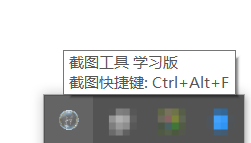
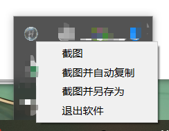
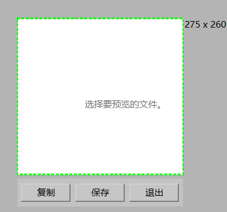

# ScreenCutTool
用 QT6 实现的一个简易截图软件

截图功能核心实现：[使用 QT6 实现截图功能 | Hardews.Site](https://hardews.cn/2024/11/17/article/2024-11-17_%E4%BD%BF%E7%94%A8%20QT6%20%E5%AE%9E%E7%8E%B0%E4%B8%80%E4%B8%AA%E6%88%AA%E5%9B%BE%E8%BD%AF%E4%BB%B6/)

基于截图功能的软件实现：[使用 QT6 实现一个截图软件 | Hardews.Site](https://hardews.cn/2024/11/16/article/2024-11-16_%E4%BD%BF%E7%94%A8%20QT6%20%E5%AE%9E%E7%8E%B0%E6%88%AA%E5%9B%BE%E5%8A%9F%E8%83%BD/)

安装程序下载目录下的 `ScreenCutTool.exe`（使用 `Qt Installer Framework` 打包，参考博文：[《Qt5+安装包制作（Qt Installer Framework）》_qt installer framework 自定义安装界面](https://blog.csdn.net/mars_xiaolei/article/details/83825447)

## 实现功能

- [x] 启动自动隐藏到托盘
- [x] 点击托盘上的程序 logo 截图
- [x] 截图
- [x] 截图后复制到剪贴板
- [x] 截图后自动复制到剪贴板
- [x] 快捷键截图(Ctrl+Alt+F)
- [x] 截图后另存为

## 部分效果图

